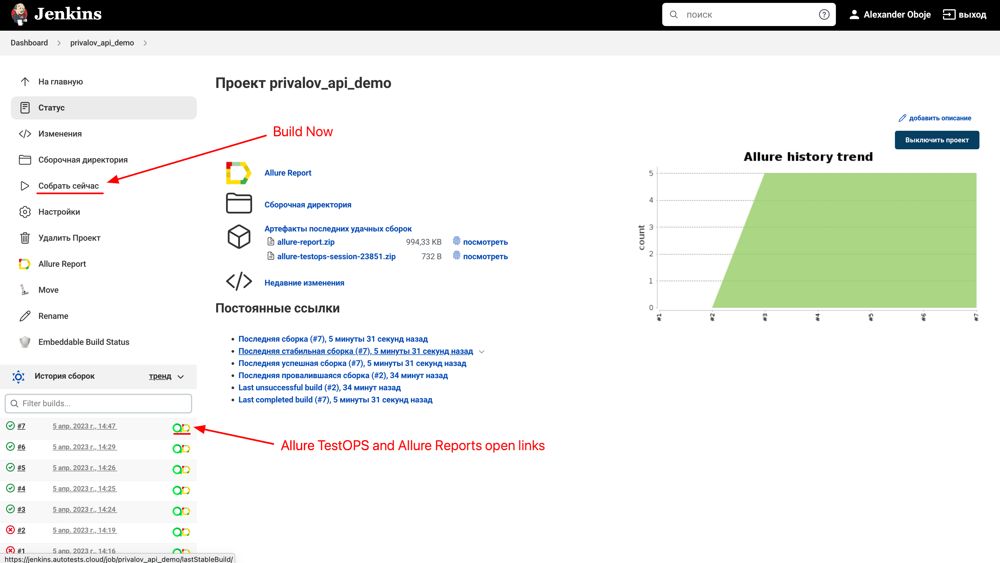
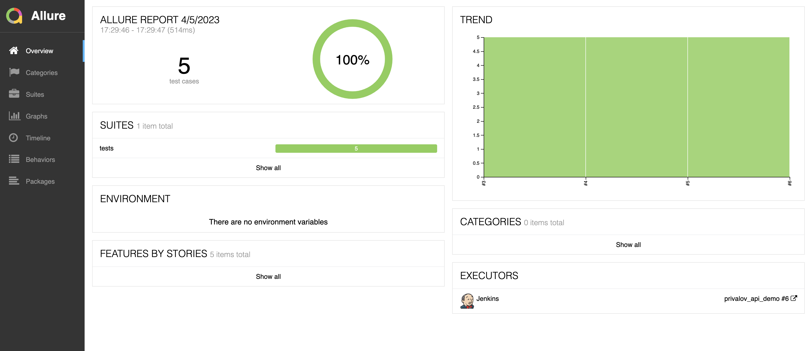
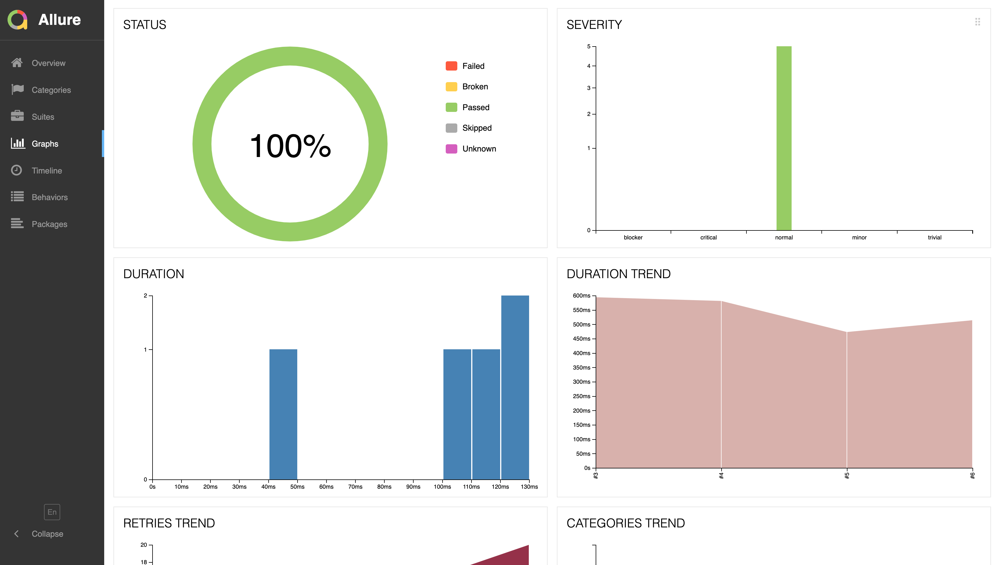
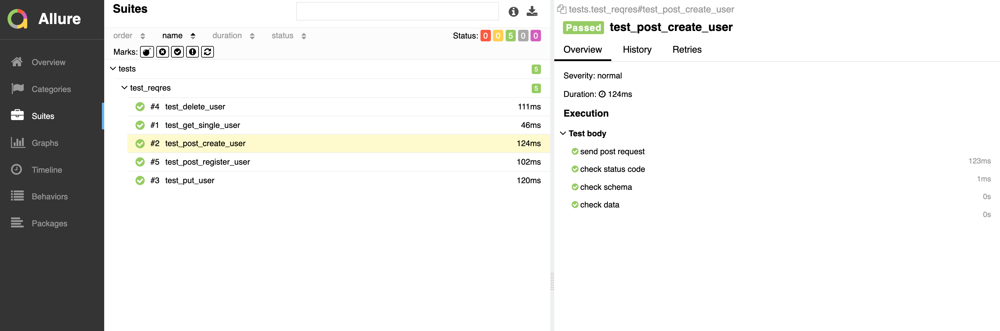
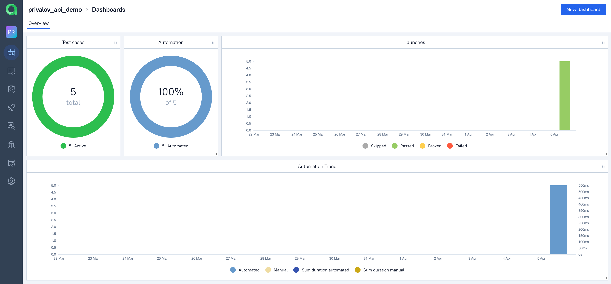
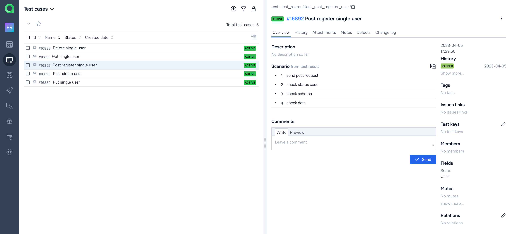
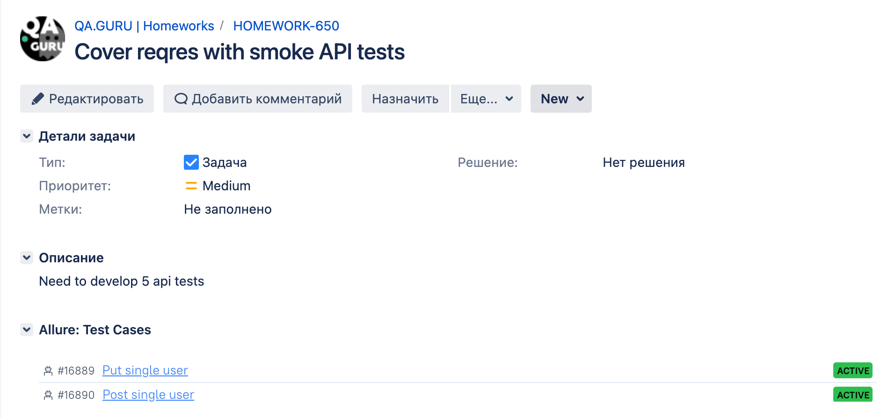
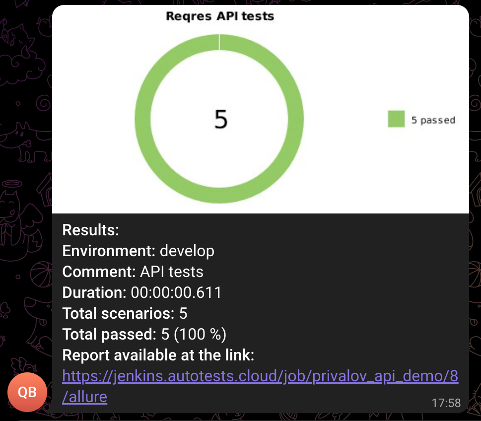

## Project API automated tests for reqres.in

<!-- Технологии -->

### Used technologies

  <code></code>
  <code></code>
  <code></code>
  <code></code>
  <code></code>
  <code></code>
  <code></code>
  <code></code>
  <code></code>
  <code></code>

<!-- Тест кейсы -->

### What are we testing
* GET single user
* POST create user
* PUT user
* DELETE user
* POST register user

<!-- Jenkins -->

###  Running the project in Jenkins.
### [Job](https://jenkins.autotests.cloud/job/api_reqres_qa_guru_python_2/)
##### Clicking on "Build Now" will start the test build and execution process.

<!-- Allure report -->

###  Allure report.
##### After the tests have passed, you can view the results in the Allure report, which also contains a link to Jenkins.

##### In the Graphs tab, you can view charts about the test execution, based on their prioritization, execution time, and other parameters.

##### In the Suites tab, you can find the collected test cases, which describe the steps.

<!-- Allure TestOps -->

###  Allure TestOps Integration.
### [Dashboard](https://allure.autotests.cloud/project/1719/dashboards)
##### Also, all reporting is saved in Allure TestOps, where similar charts are built.

#### In the suites tab, we can:
- Manage all test cases or each one separately
- Restart each test separately from all tests
- Configure integration with Jira
- Add manual tests, etc.

<!-- Jira -->

###  Jira Integration.
##### By setting up integration with Jira through Allure TestOps, you can pass the test execution results and the list of test cases from Allure to the ticket.

<!-- Telegram -->

###  Telegram integration.
##### After the tests have passed, a Telegram bot sends a message with a chart and some brief information about the tests.

